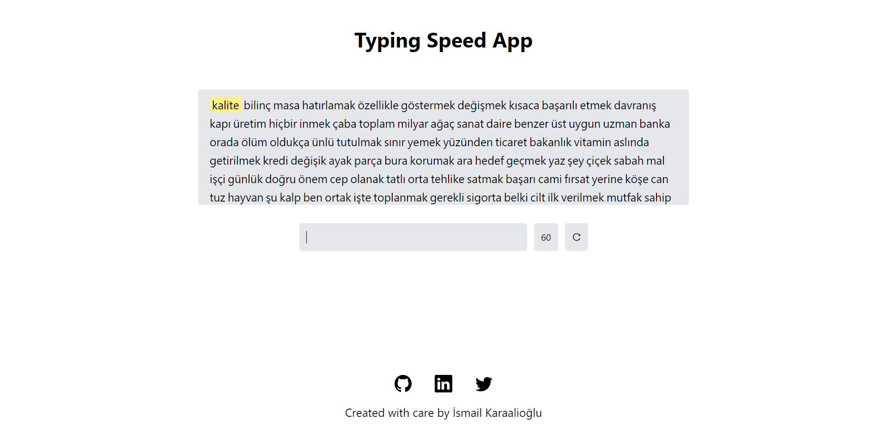
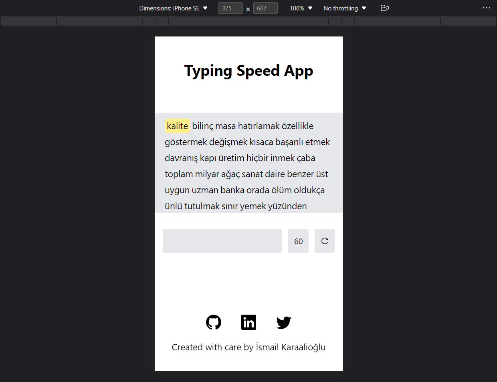

# Typing Speed App with React

- Patika.dev Redux module "Typing Speed App" project.

## :sparkles: Live Demo

## :computer: Setup

1. Clone the repository and install its features.

```
npm install or yarn install
```

2. Use the project locally (localhost).

```
npm start or yarn start
```

## :fire: Technologies and Libraries

:point_right: React.js <br />
:point_right: Redux <br />
:point_right: Redux Toolkit <br />
:point_right: Tailwind CSS <br />
:point_right: Classnames <br />
:point_right: React-Icons <br />
:point_right: SweetAlert2 <br />

## Screenshot

